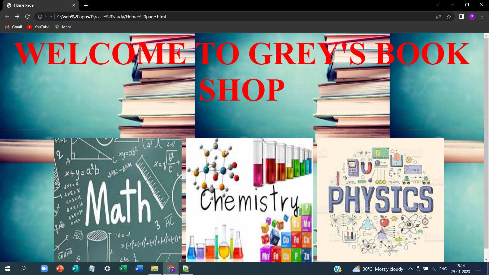
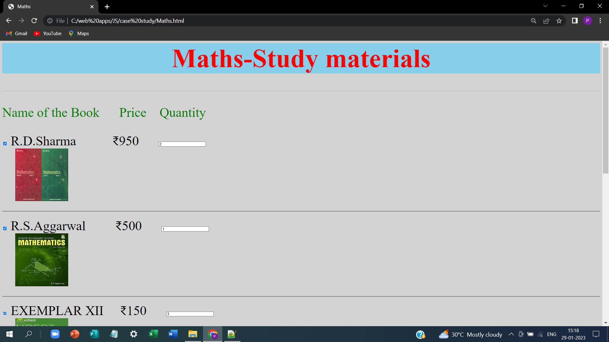
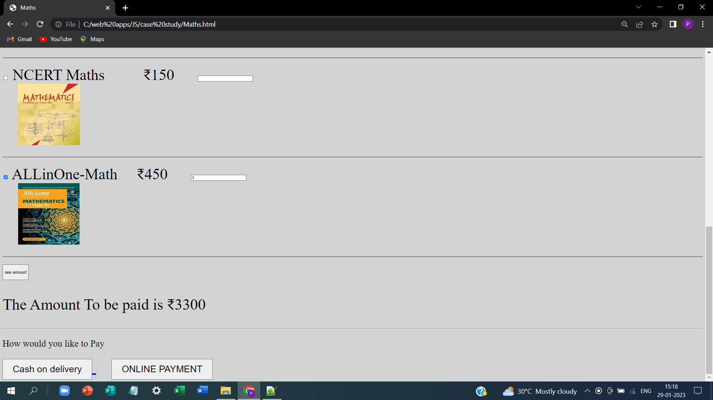
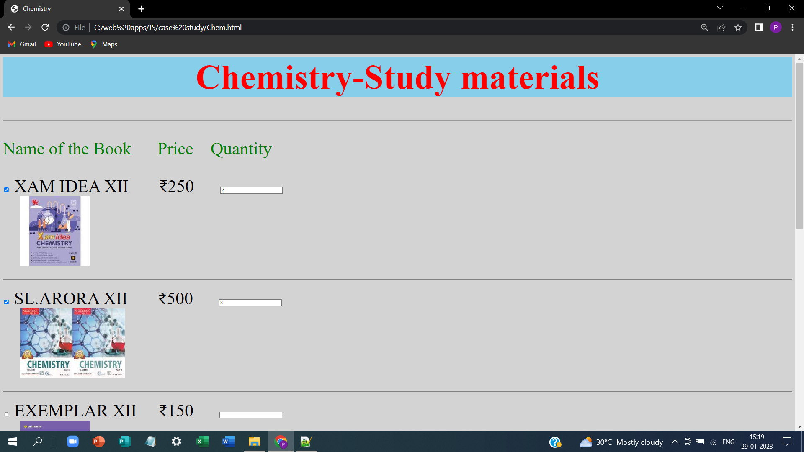
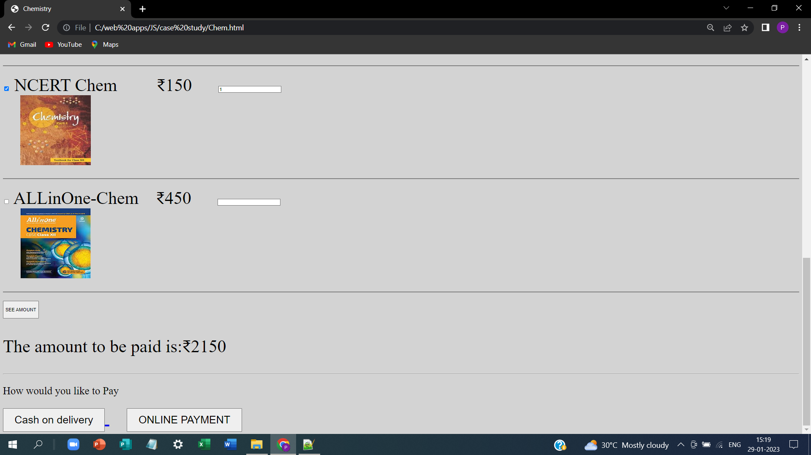
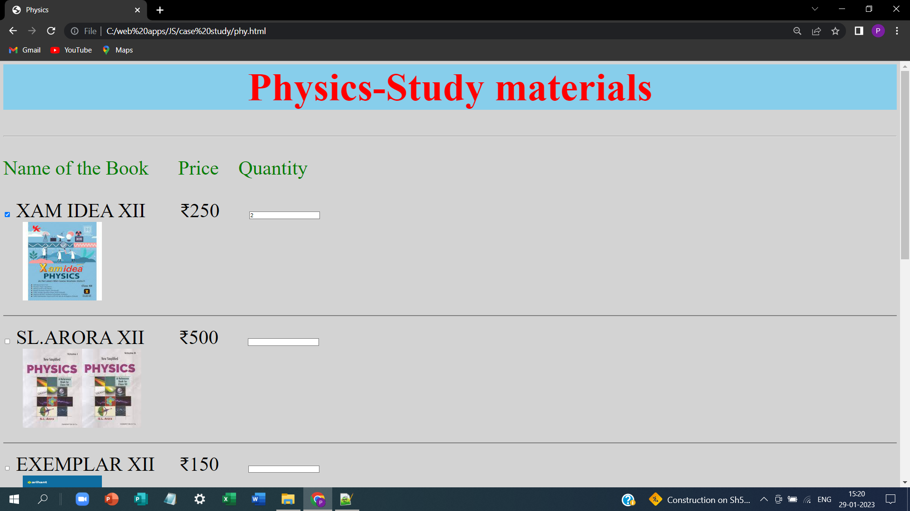
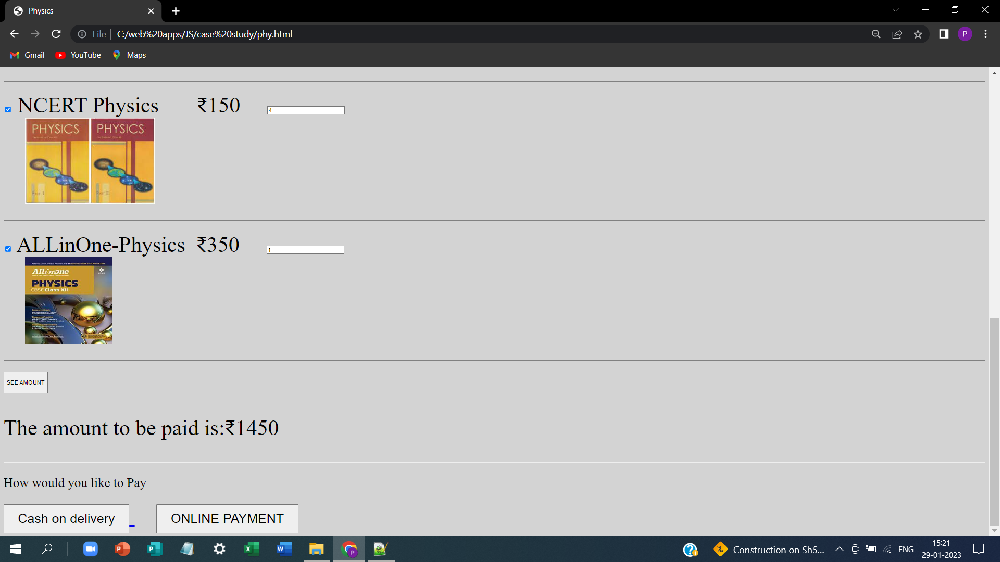

# Web Design for a Software Product Company

## AIM:

To design a static website for a software product company company.

## DESIGN STEPS:

### Step 1:

Requirement collection.

### Step 2:

Creating the layout using HTML and CSS.

### Step 3:

Updating the sample content.

### Step 4:

Choose the appropriate style and color scheme.

### Step 5:

Validate the layout in various browsers.

### Step 6:

Validate the HTML code.

### Step 7:

Publish the website in the given URL.

## PROGRAM :
Home.html
```html
<html>
<head>
<title>Home Page</title>
</head>
<style>
</style>
<body style="background-color:lightgrey;font-size:50px;background-image:url('background.jpg');">
<h1 style='text-align:center;color:red;'>WELCOME TO GREY'S BOOK SHOP<mark></mark></h1>
<hr noshade>
&nbsp;&nbsp;&nbsp;&nbsp;&nbsp;&nbsp;&nbsp;&nbsp;&nbsp;&nbsp;&nbsp;&nbsp;
<a href='Maths.html'>

</a>
<a href='Chem.html'>

</a>
<a href='phy.html'>

</a>
<script>
</script>
</body>
</html>
```
Physics.html
```html
<html>
<head>
<title> Physics</title>
</head>
<style>
.button
{
 text-align: center;
 padding: 15px 32px;
 font-size:30px;
}
.format
{
font-size:50px;
background-color:lightgrey;
}
.align
{
background-color:skyblue;
text-align:center;
color:red;
}
</style>
<body class='format'>
<h1 class='align' >Physics-Study materials</h1><hr>
<p style='color:Green'>
Name of the Book &nbsp;&nbsp;&nbsp;&nbsp; Price&nbsp;&nbsp;&nbsp;&nbsp;Quantity</p>

<form > 
   <input type = "checkbox" id = "item1" name = "item1"   >
   <label for = "item1">XAM IDEA XII &nbsp;&nbsp;&nbsp;&nbsp;&nbsp;&nbsp;₹250 </label> &nbsp;&nbsp;&nbsp;&nbsp;
   <input type='number' id='quan1'><br>&nbsp;&nbsp;&nbsp;
   
   <hr noshade>
   <input type ="checkbox" id = "item2" name ="item2"  >
   <label for = "item2">SL.ARORA XII &nbsp;&nbsp;&nbsp;&nbsp;&nbsp; ₹500 </label> &nbsp;&nbsp;&nbsp;&nbsp;
    <input type='number' id='quan2'><br>&nbsp;&nbsp;&nbsp;
	
	<hr noshade>
   <input type = "checkbox" id = "item3" name ="item3" >
   <label for = "item3">EXEMPLAR XII &nbsp;&nbsp;&nbsp;&nbsp;₹150 </label> &nbsp;&nbsp;&nbsp;&nbsp;
    <input type='number' id='quan3'><br>&nbsp;&nbsp;&nbsp;
	
   <hr noshade>
   <input type = "checkbox" id = "item4" name ="item4" >   
   <label for = "item4">NCERT Physics &nbsp;&nbsp;&nbsp;&nbsp;&nbsp;&nbsp;₹150 </label> &nbsp;&nbsp;&nbsp;   
   <input type='number' id='quan4'><br>&nbsp;&nbsp;&nbsp;
   
   <hr noshade>
   <input type = "checkbox" id = "item5" name ="item5" >   
   <label for = "item4">ALLinOne-Physics &nbsp;₹350 </label> &nbsp;&nbsp;&nbsp;   
   <input type='number' id='quan5'><br>&nbsp;&nbsp;&nbsp;
   
   <hr noshade>
   <input type='button' onclick='check1()'value='SEE AMOUNT' style='height:50px;'>
</form> 
<p id='amt'>The amount to be paid is:₹click</p>
<hr>  
<script>
function check1(){
var amount=0
var checkbox1=document.getElementById('item1');
var checkbox2=document.getElementById('item2');
var checkbox3=document.getElementById('item3');
var checkbox4=document.getElementById('item4');
var checkbox5=document.getElementById('item5');
 if(checkbox1.checked==true)
  {
   var x=document.getElementById('quan1').value 
   if (x=='')
     {
	   amount='Please enter the quantity';
	 }
   else
     {	 
     amount+=250*x
	 }
  }
  if(checkbox2.checked==true)
  {
   var x=document.getElementById('quan2').value  
   if (x=='')
     {
	   amount='Please enter the quantity';
	 }
   else
     {	 
     amount+=500*x
	 }
  }
  if(checkbox3.checked==true)
  {
   var x=document.getElementById('quan3').value
   if (x=='')
     {
	   amount='Please enter the quantity';
	 }
   else
     {	 
     amount+=150*x
	 }
  }
   if(checkbox4.checked==true)
  {
   var x=document.getElementById('quan4').value
   if (x=='')
     {
	   amount='Please enter the quantity';
	 }
   else
     {	 
     amount+=150*x
	 }
  }
    if(checkbox5.checked==true)
  {
    var x=document.getElementById('quan5').value
   if (x=='')
     {
	   amount='Please enter the quantity';
	 }
   else
     {	 
     amount+=350*x
	 }
  }
 var str=document.getElementById('amt').innerHTML;
 document.getElementById('amt').innerHTML=str.replace('click',amount)   
} 
</script>
<p style='font-size:30px;'> How would you like to Pay</p>
<a href ='C:\web apps\JS\case study\COD.html'>
<button class='button'>Cash on delivery</button>
</a>&nbsp;&nbsp;&nbsp;
<a href ='C:\web apps\JS\case study\Online pay.html'>
<button class='button'>ONLINE PAYMENT</button>
</a>
</body>
</html>
```
Chem.html
``` html
<html>
<head>
<title>Chemistry</title>
</head>
<style>
.button
{
 text-align: center;
 padding: 15px 32px;
 font-size:30px;
}
.format
{
font-size:50px;
background-color:lightgrey;
}
.align
{
background-color:skyblue;
text-align:center;
color:red;
}
</style>
<body class='format'>
<h1 class='align' >Chemistry-Study materials</h1><hr>
<p style='color:Green'>
Name of the Book &nbsp;&nbsp;&nbsp;&nbsp; Price&nbsp;&nbsp;&nbsp;&nbsp;Quantity</p>

<form > 
   <input type = "checkbox" id = "item1" name = "item1"   >
   <label for = "item1">XAM IDEA XII &nbsp;&nbsp;&nbsp;&nbsp;&nbsp;&nbsp;₹250 </label> &nbsp;&nbsp;&nbsp;&nbsp;
   <input type='number' id='quan1'><br>&nbsp;&nbsp;&nbsp;
   
   <hr noshade>
   <input type ="checkbox" id = "item2" name ="item2"  >
   <label for = "item2">SL.ARORA XII &nbsp;&nbsp;&nbsp;&nbsp;&nbsp; ₹500 </label> &nbsp;&nbsp;&nbsp;&nbsp;
    <input type='number' id='quan2'><br>&nbsp;&nbsp;&nbsp;
	
	<hr noshade>
   <input type = "checkbox" id = "item3" name ="item3" >
   <label for = "item3">EXEMPLAR XII &nbsp;&nbsp;&nbsp;&nbsp;₹150 </label> &nbsp;&nbsp;&nbsp;&nbsp;
    <input type='number' id='quan3'><br>&nbsp;&nbsp;&nbsp;
	
   <hr noshade>
   <input type = "checkbox" id = "item4" name ="item4" >   
   <label for = "item4">NCERT Chem &nbsp;&nbsp;&nbsp;&nbsp;&nbsp;&nbsp;&nbsp;&nbsp;₹150 </label> &nbsp;&nbsp;&nbsp;&nbsp;   
   <input type='number' id='quan4'><br>&nbsp;&nbsp;&nbsp;
   
   <hr noshade>
   <input type = "checkbox" id = "item5" name ="item5" >   
   <label for = "item4">ALLinOne-Chem &nbsp;&nbsp;&nbsp;₹450 </label> &nbsp;&nbsp;&nbsp;&nbsp;
   <input type='number' id='quan5'><br>&nbsp;&nbsp;&nbsp;
   
   <hr noshade>
   <input type='button' onclick='check1()'value='SEE AMOUNT' style='height:50px;'>
</form> 
<p id='amt'>The amount to be paid is:₹click</p>
<hr>  
<script>
function check1(){
var amount=0
var checkbox1=document.getElementById('item1');
var checkbox2=document.getElementById('item2');
var checkbox3=document.getElementById('item3');
var checkbox4=document.getElementById('item4');
var checkbox5=document.getElementById('item5');
 if(checkbox1.checked==true)
  {
   var x=document.getElementById('quan1').value 
   if (x=='')
     {
	   amount='Please enter the quantity';
	 }
   else
     {	 
     amount+=250*x
	 }
  }
  if(checkbox2.checked==true)
  {
   var x=document.getElementById('quan2').value  
   if (x=='')
     {
	   amount='Please enter the quantity';
	 }
   else
     {	 
     amount+=500*x
	 }
  }
  if(checkbox3.checked==true)
  {
   var x=document.getElementById('quan3').value
   if (x=='')
     {
	   amount='Please enter the quantity';
	 }
   else
     {	 
     amount+=150*x
	 }
  }
   if(checkbox4.checked==true)
  {
   var x=document.getElementById('quan4').value
   if (x=='')
     {
	   amount='Please enter the quantity';
	 }
   else
     {	 
     amount+=150*x
	 }
  }
    if(checkbox5.checked==true)
  {
    var x=document.getElementById('quan5').value
   if (x=='')
     {
	   amount='Please enter the quantity';
	 }
   else
     {	 
     amount+=450*x
	 }
  }
 var str=document.getElementById('amt').innerHTML;
 document.getElementById('amt').innerHTML=str.replace('click',amount)   
} 
</script>
<p style='font-size:30px;'> How would you like to Pay</p>
<a href ='C:\web apps\JS\case study\COD.html'>
<button class='button'>Cash on delivery</button>
</a>&nbsp;&nbsp;&nbsp;
<a href ='C:\web apps\JS\case study\Online pay.html'>
<button class='button'>ONLINE PAYMENT</button>
</a>
</body>
</html>
```

Math.html
``` html
<html>
<head>
<title>Maths</title>
</head>
<style>
.button
{
 text-align: center;
 padding: 15px 32px;
 font-size:30px;
}
.format
{
font-size:50px;
background-color:lightgrey;
}
.align
{
background-color:skyblue;
text-align:center;
color:red;
}
</style>
<body class='format'>
<h1 class='align' >Maths-Study materials</h1><hr>
<p style='color:Green'>
Name of the Book &nbsp;&nbsp;&nbsp;&nbsp; Price&nbsp;&nbsp;&nbsp;&nbsp;Quantity</p>

<form> 
   <input type = "checkbox" id = "item1" name = "item1"   >
   <label for = "item1">R.D.Sharma &nbsp;&nbsp;&nbsp;&nbsp;&nbsp;&nbsp;&nbsp;&nbsp;&nbsp;&nbsp;₹950 </label> &nbsp;&nbsp;&nbsp;&nbsp;
   <input type='number' id='quan1'><br>&nbsp;&nbsp;&nbsp;
   
   <hr noshade>
   <input type ="checkbox" id = "item2" name ="item2"  >
   <label for = "item2">R.S.Aggarwal &nbsp;&nbsp;&nbsp;&nbsp;&nbsp;&nbsp;&nbsp; ₹500 </label> &nbsp;&nbsp;&nbsp;&nbsp;
    <input type='number' id='quan2'><br>&nbsp;&nbsp;&nbsp;
	
	<hr noshade>
   <input type = "checkbox" id = "item3" name ="item3" >
   <label for = "item3">EXEMPLAR XII &nbsp;&nbsp;&nbsp;&nbsp;₹150 </label> &nbsp;&nbsp;&nbsp;&nbsp;
    <input type='number' id='quan3'><br>&nbsp;&nbsp;&nbsp;
	
   <hr noshade>
   <input type = "checkbox" id = "item4" name ="item4" >   
   <label for = "item4">NCERT Maths &nbsp;&nbsp;&nbsp;&nbsp;&nbsp;&nbsp;&nbsp;&nbsp;&nbsp;₹150 </label> &nbsp;&nbsp;&nbsp;&nbsp;   
   <input type='number' id='quan4'><br>&nbsp;&nbsp;&nbsp;
   
   <hr noshade>
   <input type = "checkbox" id = "item5" name ="item5" >   
   <label for = "item4">ALLinOne-Math &nbsp;&nbsp;&nbsp;&nbsp;₹450 </label> &nbsp;&nbsp;&nbsp;&nbsp;
   <input type='number' id='quan5'><br>&nbsp;&nbsp;&nbsp;
   
   <hr noshade>
   <!--<input type='button' onclick='check1()'value='SEE AMOUNT' style='height:50px;'>-->
   <button onclick='check1()' value='see amount' style='height:50px;'>see amount</button>
</form> 
<p id='amt'></p>
<hr>  
<script>
function check1(){
var amount=0
var checkbox1=document.getElementById('item1');
var checkbox2=document.getElementById('item2');
var checkbox3=document.getElementById('item3');
var checkbox4=document.getElementById('item4');
var checkbox5=document.getElementById('item5');
 if(checkbox1.checked==true)
  {
   var x=document.getElementById('quan1').value 
   if (x=='')
     {
	   amount='Please enter the quantity';
	 }
   else if(x)
     {	 
     amount+=950*x
	 }
   }
  if(checkbox1.checked==false)
    {
     amount+=0
    }	 
  if(checkbox2.checked==true)
  {
   var x=document.getElementById('quan2').value  
   if (x=='')
     {
	   amount='Please enter the quantity';
	 }
   else
     {	 
     amount+=500*x
	 }
  }
    if(checkbox2.checked==false)
    {
     amount+=0
    }
  if(checkbox3.checked==true)
  {
   var x=document.getElementById('quan3').value
   if (x=='')
     {
	   amount='Please enter the quantity';
	 }
   else
     {	 
     amount+=150*x
	 }
  }
    if(checkbox3.checked==false)
    {
     amount+=0
    }
   if(checkbox4.checked==true)
  {
   var x=document.getElementById('quan4').value
   if (x=='')
     {
	   amount='Please enter the quantity';
	 }
   else
     {	 
     amount+=150*x
	 }
  }
    if(checkbox4.checked==false)
    {
     amount+=0
    }
    if(checkbox5.checked==true)
  {
    var x=document.getElementById('quan5').value
   if (x=='')
     {
	   amount='Please enter the quantity';
	 }
   else
     {	 
     amount+=450*x
	 }
  }
    if(checkbox5.checked==false)
    {
     amount+=0
    }
 var str=document.getElementById('amt').innerHTML='The Amount To be paid is ₹'+amount;
 event.preventDefault();
} 
</script>
<p style='font-size:30px;'> How would you like to Pay</p>
<a href ='C:\web apps\JS\case study\COD.html'>
<button class='button'>Cash on delivery</button>
</a>&nbsp;&nbsp;&nbsp;
<a href ='C:\web apps\JS\case study\Online pay.html'>
<button class='button'>ONLINE PAYMENT</button>
</a>
</body>
</html>
```
## OUTPUT:

### Home Page:

### Math.html


### Chem.html


### Phy.html



## Result:
Thus a website is designed for the software product company and the HTML,CSS code are validated.
